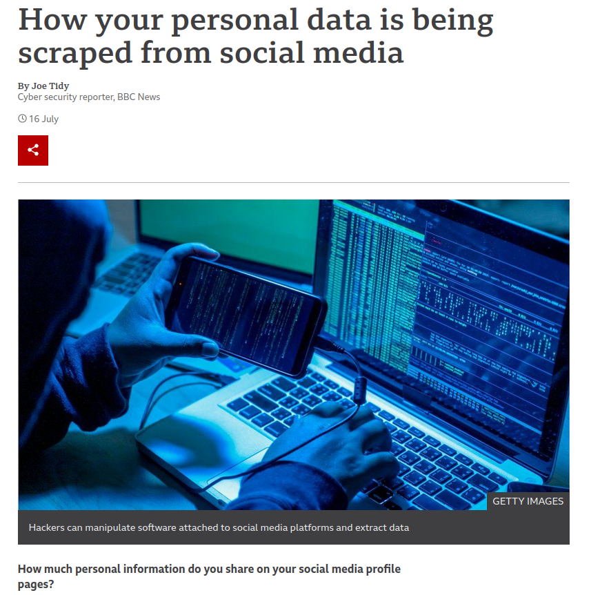
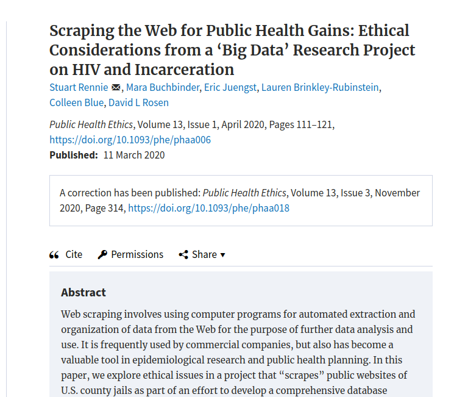
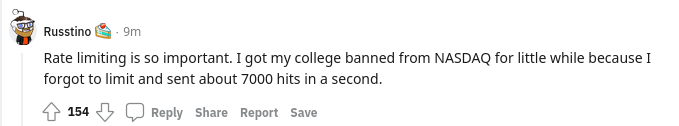

# About me 

10 years working as a data analyst – primarily in healthcare 

Started my career in Geneva and then moved to London 

Senior data analyst at a health care charity

Part-time PhD student at UCL - clinical data science

One year placement at the Alan Turing Institute - the UK's national institute for data science and artificial intelligence

RStudio certified trainer

R-Ladies London organiser
---
# Housekeeping
Chat for interaction 

Questions in chat or just interrupt me 

Please stay muted unless you are asking a question 

Cameras on or off – always nice to see people’s faces but it is your choice 

45min + 15 break final session will be 30 min  - do step away if you need to

https://emmavestesson.github.io/web-scraping/#1

---

# Workshop aim

- Know what web scraping is
- Automate tasks
- Copy data without copying and pasting manually from a website
- You will not be experts users after 3.5h but you should  know what is possible and be comfortable learning more own your own or in more advanced courses 
- Many of the functions we will cover can be used for different types of data science work

---
class: middle
# Tools we will be using today

- RStudio cloud
- Web browser (ideally chrome)
- SelectorGadget
- Selenium

---
class: inverse, middle, centre

# Let's head over to Rstudio.cloud

- Sign into rstudio.cloud 
- Start a new project from git
- Install packages
---
class: inverse, middle, centre

- Where are you joining from? 
- Have you tried to use webscraping before?

---

# Web scraping

```{r setup, include=FALSE}
options(htmltools.dir.version = FALSE)
library(rvest)
```
- Use a computer programme to extract and save information from a website 
- Also known as data scraping 
- Can be performed using a programming language such as R or python or a 'point and click' tool

---

# Is data scraping legal? 

- Often legal but not always polite 

Web scraping is much faster than a human using a website 
  - Risk overloading websites
  
  - Could get you banned (criminal offence) 
  
  - Could get everyone at your university banned


- How you use the data matters 
  – still need to respect copyright, 
  - GDPR (personal data) 
  -Selling the data is dodgy 


- 'Fair use' will probably cover most of what you want to do


---
class: center

# Legal $\neq$ ethical 

.pull-left[

]


.pull-right[

]
---

# How to check if a website can be scraped

- Check robots.txt 

- Check terms of references 

Let's look at some robots.txt files [wikipedia](https://en.wikipedia.org/robots.txt)
---

# Examples of using web scraping 

- Scrape prices on website to detect a drop in prices 

- Automatically download a data item every day - can save valuable time

- Bulk download files

- Analyse the sentiment of comments on websites or pages such as reddit 

- Link google analytics data to information on website


---
class: 

# Alternatives to web scraping 

Looking for alternatives can save you a lot of time 

- Simply ask for the data
- Files made available for download - this is getting more and more common

- APIs - eg pubmed, twitter 


- These can be combined with light touch web scraping eg to get file paths 
---


# Polite scraping 

Check what you are allowed to scrape - certain sub-pages might be excluded 

Pace yourself – add a break to slow down your scraper 


Only download and save what you actually need 

Storing the data can be a separate legal issue

---

# pipe
Simplifying R code with pipes (%>%)


nested statement
```r
leave_house(get_dressed(get_out_of_bed(wake_up(me))))
```
VS

piped statement
```r
me %>% 
  wake_up() %>% 
  get_out_of_bed() %>% 
  get_dressed() %>% 
  leave_house()
```

**Keyboard shortcut ctrl+shift +m**


---

# Packages


The first time you use a package you need to install the package. 

```r
install.packages("tidyverse")
```

Load the package

```r
library(tidyverse)
library(lubridate)
```
---


---

# Polite package

Checks the robots.txt file for you

```{r, highlight.output = c(5)}
library(polite)
bow('https://www.facebook.com/')
```
---

# Basic html

- Hyper Text Markup Language 
- Head and body
- Elements and child elements
- Some elements have attributes
  - href or src

Let's look at some raw html - [R project website](https://www.r-project.org/)

---

# Reading in a html page

`scrape` returns a html document. It automatically includes a delay based on what the website requested. 
```{r}
starwars_page <- "https://rvest.tidyverse.org/articles/starwars.html"
starwars_page %>% 
  bow() %>%
  scrape()
```
---
# rvest

- `html_elements()`

- `html_children()`

- `html_attrs()` - prints all attributes

- `html_attr()` - selects an attribute

- `html_text()` - turn the object into text

- `html_name()`

---

# Select elements
Returns an xml_nodeset
```{r}
library(rvest)
starwars_page %>% 
  bow() %>%
  scrape() %>% 
  rvest::html_elements('section') 
```


---
class: middle
# How do I know what elements to select? 

- selector gadget
- inspect page
- looking at raw html
- a lot of trial and error

---
class: inverse, middle, centre
# Break

---

# Mass download reports

- Check that we are allowed to scrape website
- Write code to download one report
- A few minutes for you to have a play
- Write code to give the report a sensible name
- Get url for all landing pages for the reports
- Combine all our code
- Test that code runs for a small number of URLs
- Ready to download all reports!
---
# Iterate over functions
```{r}
library(purrr)
map(c('Emma', 'Kyle', 'Maryam'), ~paste('Hello', .x))
```

---

# Schedule web scraping

Some web pages update a file on a regular basis and everything but the download URL stays the same.

- Check that we are allowed to scrape website
- Write code to download file
- Write code to give the file a sensible name
- Use cronR or taskscheduleR to schedule regular downloads

You can't turn your computer off. 


---
# APIs 

**Wikipedia definition** : An application programming interface (API) is a computing interface which defines interactions between multiple software intermediaries.

APIs are provided to move traffic away from the main website

APIs can be a good alternative to web scraping.

Will most likely save you time

Removes most of the concerns around legality and ethics around accessing- if data is available through the API then it is fine to download
---

# Medrxiv

First we will head over to https://www.medrxiv.org/robots.txt
Let's look at the `medrxivr` package and the biorxiv API https://api.biorxiv.org/

```{r}
library(medrxivr)

```


---
class: middle
# Selenium

>Selenium automates browsers. That's it!
What you do with that power is entirely up to you

--

Selenium requires a bit of work to install so I will demo on my laptop

We are going back to the WHO page with all the reports again

---
class: inverse, middle, center

# Thank you


